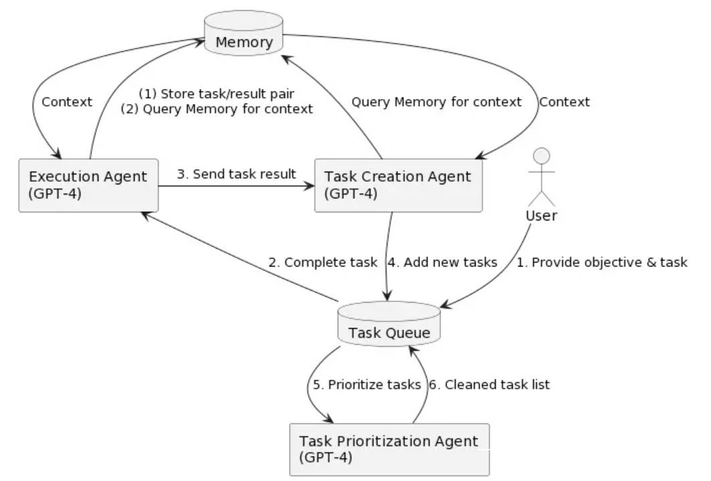

# Awesome AGI Resources  

A curated list of awesome AGI frameworks, software, and resources.

Mirrors:

Related Resources:  [ChatGPT 中文指南](https://github.com/yzfly/awesome-chatgpt-zh) 🔥

## What is AGI?
> Artificial General Intelligence (AGI) refers to advanced AI systems that exhibit human-like cognitive abilities across various tasks and domains. Unlike narrow AI, which excels in specific tasks, AGI aims to encompass learning, reasoning, problem-solving, perception, and natural language understanding. Although AGI remains an ambitious goal, its pursuit has led to numerous AI advancements. The development of AGI holds the potential to revolutionize industries such as healthcare, finance, transportation, and education, while also raising ethical, safety, and societal concerns that must be carefully addressed.

- [Awesome AGI Resources ](#awesome-agi-resources-)
  - [What is AGI?](#what-is-agi)
  - [Frameworks and Platforms](#frameworks-and-platforms)
    - [Auto-GPT](#auto-gpt)
    - [OpenAGI](#openagi)
    - [babyagi](#babyagi)
    - [AgentGPT](#agentgpt)
    - [ai-legion](#ai-legion)
  - [Papers, Courses and Lectures](#papers-courses-and-lectures)
    - [Papers](#papers)
    - [awesome-agi-cocosci](#awesome-agi-cocosci)
  - [Websites and Blogs](#websites-and-blogs)
    - [The Marketplace for AI Agents](#the-marketplace-for-ai-agents)
    - [generative agents](#generative-agents)
  - [Tutorials and Guides](#tutorials-and-guides)

## Frameworks and Platforms

---

### [Auto-GPT](https://github.com/Torantulino/Auto-GPT)

**An experimental open-source attempt to make GPT-4 fully autonomous.**

---

### [OpenAGI](https://github.com/agiresearch/OpenAGI)

**When LLM (Large Language Models) Meets Domain Experts.**

---

### [babyagi](https://github.com/yoheinakajima/babyagi)

**Use OpenAI and Pinecone APIs to create, prioritize, and execute tasks.**

- [中文博客-babyagi: 人工智能任务管理系统](https://juejin.cn/post/7218815501433946173)

---

### [AgentGPT](https://github.com/reworkd/AgentGPT)

**Assemble, configure, and deploy autonomous AI Agents in your browser.**

---

### [ai-legion](https://github.com/eumemic/ai-legion)

**An LLM-powered autonomous agent platform.**

---

## Papers, Courses and Lectures

### Papers
- [Generative Agents: Interactive Simulacra of Human Behavior](https://arxiv.org/abs/2304.03442)

### [awesome-agi-cocosci](https://github.com/YuzheSHI/awesome-agi-cocosci)

An awesome & curated list for Artificial General Intelligence, an emerging inter-discipline field that combines artificial intelligence and computational cognitive sciences.

## Websites and Blogs

### [The Marketplace for AI Agents](https://www.dataleap.xyz/)

Discover Dataleap the Upwork for AI Agents, where AutoGPTs are revolutionizing the gig economy

### [generative agents](https://reverie.herokuapp.com/arXiv_Demo/)

Westworld lured millions of us into a fantasy of human-like robots in a Wild West-themed world.

Could it be real one day?

Stanford/Google researchers just told us how they used AI to make "generative agents".

* [Demo](https://reverie.herokuapp.com/arXiv_Demo/)
* [Paper](https://arxiv.org/abs/2304.03442)
* [Twitter](https://twitter.com/nonmayorpete/status/1645355224029356032?s=20)

## Tutorials and Guides