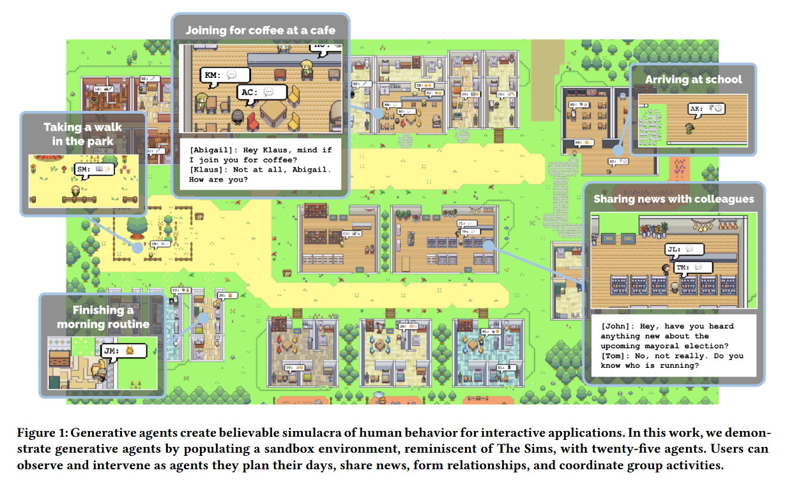
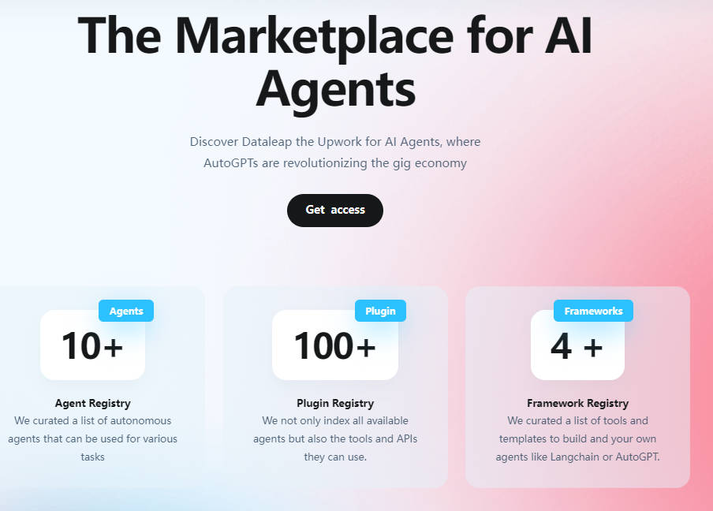

# Awesome AGI Resources  

A curated list of awesome AGI frameworks, software, and resources.

Related Resources:  [LangGPT](https://github.com/yzfly/LangGPT) 🔥

## What is AGI?
> Artificial General Intelligence (AGI) refers to advanced AI systems that exhibit human-like cognitive abilities across various tasks and domains. Unlike narrow AI, which excels in specific tasks, AGI aims to encompass learning, reasoning, problem-solving, perception, and natural language understanding. Although AGI remains an ambitious goal, its pursuit has led to numerous AI advancements. The development of AGI holds the potential to revolutionize industries such as healthcare, finance, transportation, and education, while also raising ethical, safety, and societal concerns that must be carefully addressed.

- [Awesome AGI Resources ](#awesome-agi-resources-)
  - [What is AGI?](#what-is-agi)
  - [Frameworks and Platforms](#frameworks-and-platforms)
  - [Papers, Blogs, Courses and Lectures](#papers-blogs-courses-and-lectures)
    - [Papers](#papers)
    - [Blogs and News](#blogs-and-news)
    - [awesome-agi-cocosci](#awesome-agi-cocosci)
  - [Websites](#websites)
    - [Online Demo (在线试用)](#online-demo-在线试用)
    - [Generative Agents](#generative-agents)
    - [The Marketplace for AI Agents](#the-marketplace-for-ai-agents)
  - [Tutorials and Guides](#tutorials-and-guides)

## Frameworks and Platforms

|Name|Github Stars|Introduction| Notes |
-|-|-|-
|[:fire: Auto-GPT](https://github.com/Significant-Gravitas/Auto-GPT) ||An experimental open-source attempt to make GPT-4 fully autonomous.|-|
|[Auto-GPT-Plugins](https://github.com/Significant-Gravitas/Auto-GPT-Plugins) ||Plugins for Auto-GPT.|-|
|[AutoGPT.js](https://github.com/zabirauf/AutoGPT.js)||Auto-GPT on the browser.|-|
|[AutoGPT-GUI](https://github.com/thecookingsenpai/autogpt-gui)||A graphical user interface for AutoGPT.|AutoGPT 项目的图形界面|
|[:fire: AgentGPT](https://github.com/reworkd/AgentGPT) ||Assemble, configure, and deploy autonomous AI Agents in your browser.|-|
|[:fire: JARVIS](https://github.com/microsoft/JARVIS)||A system to connect LLMs with ML community.|-|
|[:fire: babyagi](https://github.com/yoheinakajima/babyagi)||Use OpenAI and Pinecone APIs to create, prioritize, and execute tasks.|[中文博客-babyagi: 人工智能任务管理系统](https://juejin.cn/post/7218815501433946173)|
|[OpenAGI](https://github.com/agiresearch/OpenAGI) ||When LLM (Large Language Models) Meets Domain Experts.|-|
|[AI-legion](https://github.com/eumemic/ai-legion)||An LLM-powered autonomous agent platform.|-|
|[SuperAGI](https://github.com/TransformerOptimus/SuperAGI)||Build and run useful autonomous agents.|-|
|[MicroGPT](https://github.com/muellerberndt/micro-gpt)||A minimal generic autonomous agent based on GPT3.5/4. Can analyze stock prices, perform network security tests, create art, and order pizza.|-|
|[:fire: MiniGPT-4](https://github.com/Vision-CAIR/MiniGPT-4)||MiniGPT-4: Enhancing Vision-language Understanding with Advanced Large Language Models.|-|
|[Agent-LLM](https://github.com/Josh-XT/Agent-LLM)||An Artificial Intelligence Automation Platform. AI Instruction management from various providers, has an adaptive memory, and a versatile plugin system with many commands including web browsing.| 人工智能自动化平台。https://agent-llm.com/|
|[loopgpt](https://github.com/farizrahman4u/loopgpt)||Modular Auto-GPT Framework.|模块化Auto-GPT框架.|
|[AutoGPT-Next-Web](https://github.com/Dogtiti/AutoGPT-Next-Web)||Assemble, configure, and deploy autonomous AI Agents in your browser.|一键免费部署你的私人AutoGPT 网页应用.|
|[Free-AUTO-GPT-with-NO-API](https://github.com/IntelligenzaArtificiale/Free-AUTO-GPT-with-NO-API)||Free AUTOGPT with NO API is a repository that offers a simple version of Autogpt, an autonomous AI agent capable of performing tasks independently. Unlike other versions, our implementation does not rely on any paid OpenAI API, making it accessible to anyone.|众所周知 AGI 项目调用 API 很花钱，这个项目让你免费运行AutoGPT, babyagi 等 AGI 项目！|
|[opencog](https://github.com/opencog/opencog)||A framework for integrated Artificial Intelligence & Artificial General Intelligence (AGI).|集成人工智能和通用人工智能(AGI)的框架。|
|[mini-agi](https://github.com/muellerberndt/mini-agi)||MiniAGI is a minimal general-purpose autonomous agent based on GPT-3.5 / GPT-4. Can analyze stock prices, perform network security tests, create art, and order pizza.|基于 GPT-3.5 / GPT-4 的迷你AGI。 可以分析股票价格、执行网络安全测试、创作艺术品和订购比萨。|
|[big-agi](https://github.com/enricoros/big-agi)||Personal AI application powered by GPT-4 and beyond, with AI personas, AGI functions, text-to-image, voice, response streaming, code highlighting and execution, PDF import, presets for developers, much more. Deploy and gift #big-AGI-energy! Using Next.js, React, Joy.|GPT-4 驱动的个人 AI 应用，[big-agi](https://big-agi.com/)|
|[LocalAGI](https://github.com/EmbraceAGI/LocalAGI)||Locally run AGI powered by LLaMA, ChatGLM and more.|基于 LLMDA, ChatGLM 等模型的本地 AGI 项目|

## Papers, Blogs, Courses and Lectures

### Papers
- [Generative Agents: Interactive Simulacra of Human Behavior](https://arxiv.org/abs/2304.03442)
- [HuggingGPT: Solving AI Tasks with ChatGPT and its Friends in HuggingFace](https://arxiv.org/abs/2303.17580)
- [One Small Step for Generative AI, One Giant Leap for AGI: A Complete Survey on ChatGPT in AIGC Era](https://arxiv.org/abs/2304.06488)

### Blogs and News
- [Planning for AGI and beyond](https://openai.com/blog/planning-for-agi-and-beyond)- OpenAI discuss their short-term and long-term plans for achieving AGI.
- [Google DeepMind CEO Says Some Form of AGI Possible in a Few Years](https://www.wsj.com/articles/google-deepmind-ceo-says-some-form-of-agi-possible-in-a-few-years-2705f452) Google DeepMind CEO Demis Hassabis commenting on building cognitive function within AI at the Journal’s Future of Everything Festival. He cites need to develop artificial general intelligence responsibly. 
- [Governance of superintelligence](https://openai.com/blog/governance-of-superintelligence)- OpenAI discuss their ideas about the governance of superintelligence, since future AI systems dramatically more capable than even AGI.

### [awesome-agi-cocosci](https://github.com/YuzheSHI/awesome-agi-cocosci)

An awesome & curated list for Artificial General Intelligence, an emerging inter-discipline field that combines artificial intelligence and computational cognitive sciences.

## Websites

### Online Demo (在线试用)
Easily try Auto-GPT online using the following websites:

* https://www.cognosys.ai/
* https://godmode.space/
* https://agentgpt.reworkd.ai/

### [Generative Agents](https://reverie.herokuapp.com/arXiv_Demo/)

Westworld lured millions of us into a fantasy of human-like robots in a Wild West-themed world.

Could it be real one day?

Stanford/Google researchers just told us how they used AI to make "generative agents".

* [Demo](https://reverie.herokuapp.com/arXiv_Demo/)
* [Paper](https://arxiv.org/abs/2304.03442)
* [Twitter](https://twitter.com/nonmayorpete/status/1645355224029356032?s=20)

### [The Marketplace for AI Agents](https://www.dataleap.xyz/)

Discover Dataleap the Upwork for AI Agents, where AutoGPTs are revolutionizing the gig economy

## Tutorials and Guides
