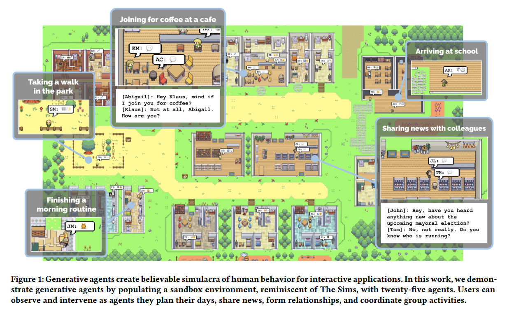
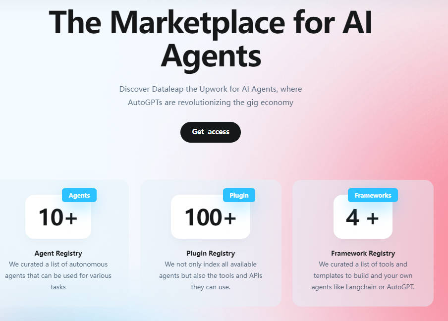

# Awesome AGI Resources  

A curated list of awesome AGI frameworks, software, and resources.

Related Resources:  [LangGPT](https://github.com/yzfly/LangGPT) 🔥

## What is AGI?
> Artificial General Intelligence (AGI) refers to advanced AI systems that exhibit human-like cognitive abilities across various tasks and domains. Unlike narrow AI, which excels in specific tasks, AGI aims to encompass learning, reasoning, problem-solving, perception, and natural language understanding. Although AGI remains an ambitious goal, its pursuit has led to numerous AI advancements. The development of AGI holds the potential to revolutionize industries such as healthcare, finance, transportation, and education, while also raising ethical, safety, and societal concerns that must be carefully addressed.

- [Awesome AGI Resources ](#awesome-agi-resources-)
  - [What is AGI?](#what-is-agi)
  - [2026 Update: Frontier Models & Agent Harnesses](#2026-update-frontier-models--agent-harnesses)
  - [Frameworks and Platforms](#frameworks-and-platforms)
  - [Papers, Blogs, Courses and Lectures](#papers-blogs-courses-and-lectures)
    - [Papers](#papers)
    - [Blogs and News](#blogs-and-news)
    - [awesome-agi-cocosci](#awesome-agi-cocosci)
  - [Websites](#websites)
    - [Online Demo (在线试用)](#online-demo-在线试用)
    - [Generative Agents](#generative-agents)
    - [The Marketplace for AI Agents](#the-marketplace-for-ai-agents)
  - [Tutorials and Guides](#tutorials-and-guides)

## 2026 Update: Frontier Models & Agent Harnesses

> Refreshed 2026-08. The 2023 "AutoGPT wave" below is kept as history; this is what the field actually runs on now. For a fuller, bilingual list see [Awesome-AGI-Agents](https://github.com/yzfly/Awesome-AGI-Agents) and [awesome-chatgpt-zh](https://github.com/EmbraceAGI/awesome-chatgpt-zh).

**Frontier models (2026)**

|Name|Developer|Link|Notes|
-|-|-|-
|Claude 5 family (Fable 5 / Opus 5 / Sonnet 5)|Anthropic|[docs](https://platform.claude.com/docs/en/about-claude/models/overview)|Jun–Jul 2026; 1M context, adaptive thinking; Fable 5 is the Mythos-class flagship|
|GPT-5.6 (Luna / Terra / Sol)|OpenAI|[openai.com](https://openai.com/index/gpt-5-6/)|Jul 2026 three-tier family; Sol is the strongest|
|Gemini 3.7 Flash / 3.1 Pro|Google DeepMind|[changelog](https://ai.google.dev/gemini-api/docs/changelog)|3.7 Flash GA Aug 2026 as the coding/agent workhorse|
|DeepSeek-V4 (Pro / Flash)|DeepSeek|[HuggingFace](https://huggingface.co/collections/deepseek-ai/deepseek-v4)|Open weights, 1M context; see [DeepSeek guide](https://github.com/EmbraceAGI/awesome-chatgpt-zh/blob/main/docs/DeepSeek.md)|
|Kimi K3|Moonshot AI|[GitHub](https://github.com/MoonshotAI/Kimi-K3)|Jul 2026 open-weight 2.8T native multimodal agentic model, 1M context|
|Qwen3.8|Alibaba|[GitHub](https://github.com/QwenLM/Qwen3.8)|Aug 2026, first Qwen-Max-class open release|
|Llama 4 (Scout / Maverick)|Meta|[developer.meta.com](https://developer.meta.com/ai/models/llama-4/)|Open-weight native multimodal MoE, up to 10M context (Scout)|

**Agent harnesses & autonomous agents (2026)**

|Name|Github Stars|Introduction| Notes |
-|-|-|-
|[Claude Code](https://github.com/anthropics/claude-code)||Anthropic's terminal agent: plans, edits, runs and verifies code in your repo|Skills, hooks, MCP, subagents|
|[OpenAI Codex](https://github.com/openai/codex)||OpenAI's open-source local coding agent CLI|Companion: [codex-security](https://github.com/openai/codex-security)|
|[deepseek-harness (dsh)](https://github.com/deepseek-ai/deepseek-harness)||DeepSeek's official open agent harness — everything is a plugin (models, tools, sandboxes)|Aug 2026; plugin ecosystem: [awesome-dsh-plugin](https://github.com/awesome-dsh-plugin/awesome-dsh-plugin)|
|[Grok Build](https://github.com/xai-org/grok-build)||xAI's full-screen TUI coding agent (Rust)|Headless / CI mode, ACP editor embedding|
|[OpenHands](https://github.com/All-Hands-AI/OpenHands)||Open platform for autonomous software-engineering agents|formerly OpenDevin|
|[Hermes Agent](https://github.com/NousResearch/hermes-agent)||Nous Research's self-evolving personal agent|—|
|[OpenClaw](https://github.com/openclaw/openclaw)||Self-hosted personal AI assistant reachable from WhatsApp / Telegram / Discord / Slack|—|
|[OpenWorker](https://github.com/andrewyng/openworker)||Andrew Ng's open desktop "AI coworker" that delivers finished work, model-agnostic|—|
|[MetaGPT](https://github.com/FoundationAgents/MetaGPT)||Multi-agent software company framework (repo moved to FoundationAgents)|also [OpenManus](https://github.com/FoundationAgents/OpenManus)|
|[TrueForge](https://github.com/truefoundry/trueforge)||Open agent runtime: model calls, MCP tools, skills, sandbox, approvals, sessions|—|
|[AgentENV](https://github.com/kvcache-ai/AgentENV)||Large-scale agent environment platform used for Kimi K3 agentic RL|Firecracker microVMs, <50ms resume|

## Frameworks and Platforms

|Name|Github Stars|Introduction| Notes |
-|-|-|-
|[:fire: Auto-GPT](https://github.com/Significant-Gravitas/Auto-GPT) ||An experimental open-source attempt to make GPT-4 fully autonomous.|-|
|[:fire: AgentGPT](https://github.com/reworkd/AgentGPT) ||Assemble, configure, and deploy autonomous AI Agents in your browser.|-|
|[:fire: MetaGPT](https://github.com/geekan/MetaGPT) ||🌟 The Multi-Agent Framework: Given one line Requirement, return PRD, Design, Tasks, Repo. |MetaGPT,多智能体框架，输入一句话的老板需求，输出用户故事 / 竞品分析 / 需求 / 数据结构 / APIs / 文件等|
|[:fire: MiniGPT-4](https://github.com/Vision-CAIR/MiniGPT-4)||MiniGPT-4: Enhancing Vision-language Understanding with Advanced Large Language Models.|-|
|[:fire: JARVIS](https://github.com/microsoft/JARVIS)||A system to connect LLMs with ML community.|-|
|[:fire: babyagi](https://github.com/yoheinakajima/babyagi)||Use OpenAI and Pinecone APIs to create, prioritize, and execute tasks.|[中文博客-babyagi: 人工智能任务管理系统](https://juejin.cn/post/7218815501433946173)|
|[SuperAGI](https://github.com/TransformerOptimus/SuperAGI)||Build and run useful autonomous agents.|-|
|[PraisonAI](https://github.com/MervinPraison/PraisonAI)||Production-ready Multi-AI Agents framework with self-reflection. Fastest agent instantiation (3.77μs), 100+ LLM support, MCP integration, agentic workflows, Python & JS SDKs.|[docs.praison.ai](https://docs.praison.ai)|
|[smol-ai/developer](https://github.com/smol-ai/developer)||the first library to let you embed a developer agent in your own app!| 在应用程序中集成agents|
|[Auto-GPT-Plugins](https://github.com/Significant-Gravitas/Auto-GPT-Plugins) ||Plugins for Auto-GPT.|-|
|[AutoGPT.js](https://github.com/zabirauf/AutoGPT.js)||Auto-GPT on the browser.|-|
|[AutoGPT-GUI](https://github.com/thecookingsenpai/autogpt-gui)||A graphical user interface for AutoGPT.|AutoGPT 项目的图形界面|
|[OpenAGI](https://github.com/agiresearch/OpenAGI) ||When LLM (Large Language Models) Meets Domain Experts.|-|
|[AI-legion](https://github.com/eumemic/ai-legion)||An LLM-powered autonomous agent platform.|-|
|[MicroGPT](https://github.com/muellerberndt/micro-gpt)||A minimal generic autonomous agent based on GPT3.5/4. Can analyze stock prices, perform network security tests, create art, and order pizza.|-|
|[Agent-LLM](https://github.com/Josh-XT/Agent-LLM)||An Artificial Intelligence Automation Platform. AI Instruction management from various providers, has an adaptive memory, and a versatile plugin system with many commands including web browsing.| 人工智能自动化平台。https://agent-llm.com/|
|[loopgpt](https://github.com/farizrahman4u/loopgpt)||Modular Auto-GPT Framework.|模块化Auto-GPT框架.|
|[AutoGPT-Next-Web](https://github.com/ConnectAI-E/AutoGPT-Next-Web)||Assemble, configure, and deploy autonomous AI Agents in your browser.|一键免费部署你的私人AutoGPT 网页应用.|
|[Free-AUTO-GPT-with-NO-API](https://github.com/IntelligenzaArtificiale/Free-AUTO-GPT-with-NO-API)||Free AUTOGPT with NO API is a repository that offers a simple version of Autogpt, an autonomous AI agent capable of performing tasks independently. Unlike other versions, our implementation does not rely on any paid OpenAI API, making it accessible to anyone.|众所周知 AGI 项目调用 API 很花钱，这个项目让你免费运行AutoGPT, babyagi 等 AGI 项目！|
|[opencog](https://github.com/opencog/opencog)||A framework for integrated Artificial Intelligence & Artificial General Intelligence (AGI).|集成人工智能和通用人工智能(AGI)的框架。|
|[mini-agi](https://github.com/muellerberndt/mini-agi)||MiniAGI is a minimal general-purpose autonomous agent based on GPT-3.5 / GPT-4. Can analyze stock prices, perform network security tests, create art, and order pizza.|基于 GPT-3.5 / GPT-4 的迷你AGI。 可以分析股票价格、执行网络安全测试、创作艺术品和订购比萨。|
|[big-agi](https://github.com/enricoros/big-agi)||Personal AI application powered by GPT-4 and beyond, with AI personas, AGI functions, text-to-image, voice, response streaming, code highlighting and execution, PDF import, presets for developers, much more. Deploy and gift #big-AGI-energy! Using Next.js, React, Joy.|GPT-4 驱动的个人 AI 应用，[big-agi](https://big-agi.com/)|
|[DemoGPT](https://github.com/melih-unsal/DemoGPT)||DemoGPT enables you to create quick demos by just using prompts.|DemoGPT 使您只需使用句子即可创建快速演示。|
|[LocalAGI](https://github.com/EmbraceAGI/LocalAGI)||Locally run AGI powered by LLaMA, ChatGLM and more.|基于 LLMDA, ChatGLM 等模型的本地 AGI 项目|
|[Agentfield](https://github.com/Agent-Field/agentfield)||Kubernetes-style control plane for deploying AI agents as distributed microservices, with built-in service discovery, durable workflows, and observability.|AI Agent 分布式部署控制平面|

|[Bifrost](https://github.com/maximhq/bifrost)|-|Open-source, self-hosted AI gateway for multi-provider routing, load balancing, failover, observability, and OpenAI-compatible APIs.|-|

## Agents

|Name|Github Stars|Introduction| Notes |
-|-|-|-
|[:fire:generative_agents](https://github.com/joonspk-research/generative_agents)||Generative Agents: Interactive Simulacra of Human Behavior.| 斯坦福和谷歌的研究人员以《模拟人生》游戏为灵感，创建的 AI 智能体小镇；研究人员在模拟城镇中添加了 25 个生成式智能体 (Generative Agents)，这 25 个角色由 ChatGPT 和自定义代码控制，以高度逼真的行为独立地生活。在 ChatGPT 的支持下，每个人都有自己独特的身份、记忆和行为，并且可以独立交互，但他们都不会意识到自己是生活在模拟中。[中文介绍](https://www.oschina.net/news/253170/generative-agents-open-source)|
|[:fire:ai-town](https://github.com/a16z-infra/ai-town)||A MIT-licensed, deployable starter kit for building and customizing your own version of AI town - a virtual town where AI characters live, chat and socialize.| 著名投资机构 a16z 开源的 AI 小镇 |
|[:fire: gpt-engineer](https://github.com/AntonOsika/gpt-engineer)||Specify what you want it to build, the AI asks for clarification, and then builds it.|全栈开发 Agent，用 GPT 编写整个项目代码！|
|[:fire: MetaGPT](https://github.com/geekan/MetaGPT) ||🌟 The Multi-Agent Framework: Given one line Requirement, return PRD, Design, Tasks, Repo. |MetaGPT, 多智能体框架，输入一句话的老板需求，输出用户故事 / 竞品分析 / 需求 / 数据结构 / APIs / 文件等|
|[gpt-researcher](https://github.com/assafelovic/gpt-researcher)||GPT based autonomous agent that does online comprehensive research on any given topic.| 用于课题研究的 agents|
|[llama-hub,shopify agent](https://github.com/emptycrown/llama-hub/blob/main/llama_hub/tools/notebooks/shopify.ipynb)||A customer support agent 🤖 that can interface with @Shopify’s ENTIRE GraphQL API Spec (>50k lines!).| llama-hub 构建的客户支持 agent，能够与 @Shopify 的整个 GraphQL API规范(>5万行!)交互|
|[FastGPT](https://github.com/labring/FastGPT)||FastGPT is a knowledge-based question answering system built on the LLM. It offers out-of-the-box data processing and model invocation capabilities. Moreover, it allows for workflow orchestration through Flow visualization, thereby enabling complex question and answer scenarios!|FastGPT 是一个基于 LLM 大语言模型的知识库问答系统，提供开箱即用的数据处理、模型调用等能力。同时可以通过 Flow 可视化进行工作流编排，从而实现复杂的问答场景！|
|[autogen](https://github.com/microsoft/autogen)||AutoGen is a framework that enables development of LLM applications using multiple agents that can converse with each other to solve task.| AutoGen是一个框架，它允许使用多个 agents 来开发LLM应用程序，这些代理可以相互交谈以解决任务。|

## Papers, Dataset, Blogs, Courses and Lectures

### Papers
- [Generative Agents: Interactive Simulacra of Human Behavior](https://arxiv.org/abs/2304.03442)
- [HuggingGPT: Solving AI Tasks with ChatGPT and its Friends in HuggingFace](https://arxiv.org/abs/2303.17580)
- [One Small Step for Generative AI, One Giant Leap for AGI: A Complete Survey on ChatGPT in AIGC Era](https://arxiv.org/abs/2304.06488)
- [AgentBench: Evaluating LLMs as Agents](https://arxiv.org/abs/2308.03688)

### Datasets

|Name|Github Stars|Introduction| Notes |
-|-|-|-
|[AGIEval](https://github.com/microsoft/AGIEval) ||AGIEval is a human-centric benchmark specifically designed to evaluate the general abilities of foundation models in tasks pertinent to human cognition and problem-solving.|-|

### Blogs and News
- [:fire: LLM Powered Autonomous Agents](https://lilianweng.github.io/posts/2023-06-23-agent/)The potentiality of LLM extends beyond generating well-written copies, stories, essays and programs; it can be framed as a powerful general problem solver.
- [Planning for AGI and beyond](https://openai.com/blog/planning-for-agi-and-beyond)- OpenAI discuss their short-term and long-term plans for achieving AGI.
- [Google DeepMind CEO Says Some Form of AGI Possible in a Few Years](https://www.wsj.com/articles/google-deepmind-ceo-says-some-form-of-agi-possible-in-a-few-years-2705f452) Google DeepMind CEO Demis Hassabis commenting on building cognitive function within AI at the Journal’s Future of Everything Festival. He cites need to develop artificial general intelligence responsibly. 
- [Governance of superintelligence](https://openai.com/blog/governance-of-superintelligence)- OpenAI discuss their ideas about the governance of superintelligence, since future AI systems dramatically more capable than even AGI.
- [Way To AGI](https://blog.waytoagi.com/) Chinese Knowledge Base of Everthing about AGI.

### [awesome-agi-cocosci](https://github.com/YuzheSHI/awesome-agi-cocosci)

An awesome & curated list for Artificial General Intelligence, an emerging inter-discipline field that combines artificial intelligence and computational cognitive sciences.

## Websites

### Online Demo (在线试用)
Easily try Auto-GPT online using the following websites:

* https://www.cognosys.ai/
* https://godmode.space/
* https://agentgpt.reworkd.ai/

### [Generative Agents](https://reverie.herokuapp.com/arXiv_Demo/)

Westworld lured millions of us into a fantasy of human-like robots in a Wild West-themed world.

Could it be real one day?

Stanford/Google researchers just told us how they used AI to make "generative agents".

* [Demo](https://reverie.herokuapp.com/arXiv_Demo/)
* [Paper](https://arxiv.org/abs/2304.03442)
* [Twitter](https://twitter.com/nonmayorpete/status/1645355224029356032?s=20)
* [Code](https://github.com/joonspk-research/generative_agents)

### [The Marketplace for AI Agents](https://www.dataleap.xyz/)

Discover Dataleap the Upwork for AI Agents, where AutoGPTs are revolutionizing the gig economy

